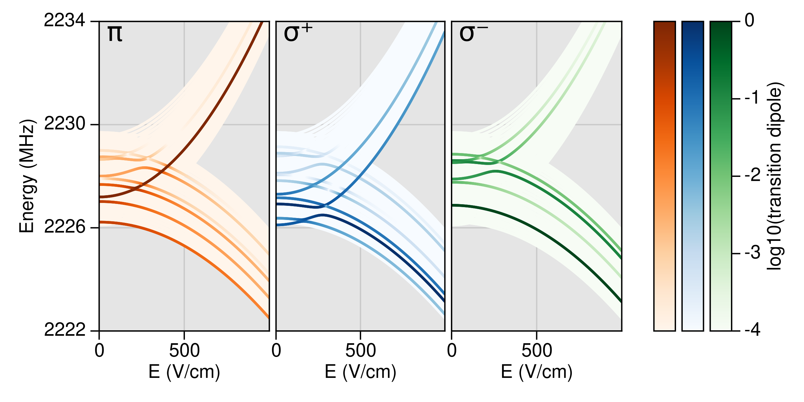

# BialkaliSpectrum.jl

Calculate the energy levels of diatomic ¹Σ molecules in magnetic, electric, and optical fields.

Example calculation: ${}^{40}\text{K}^{87}\text{Rb}$ transitions from a particular hyperfine state as a function of electric field. 

# Installation

This package is not yet entered into the Julia package registry,
but `Pkg` can find it using this repo's url. At the Julia REPL:

`import Pkg; Pkg.add(url="https://github.com/kylematsuda/BialkaliSpectrum.jl")`

# Documentation

Can be found [here](https://kylematsuda.github.io/BialkaliSpectrum.jl/dev/).

# Todo
- [ ] Add a usage example to the guide
- [ ] Add an example Jupyter notebook
- [ ] Flesh out docs, docstrings
- [ ] Many more tests
